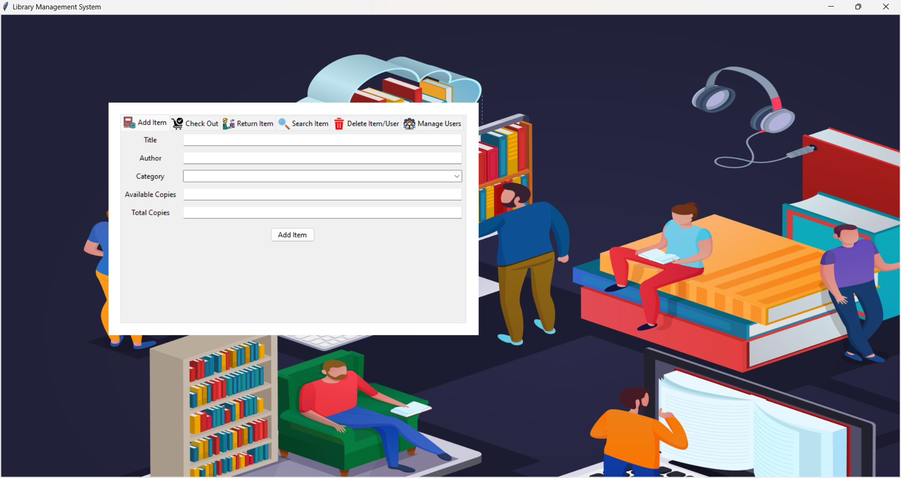

**Name:** JESHU DENZIL DEVE.M

**Company:** CODTECH IT SOLUTIONS

**ID:** CT08DS8521

**Domain:** PYTHON PROGRAMMING

**Duration:** SEPT TO OCT 2024

# 📚 Library Management System

Welcome to the **Library Management System**! This application allows users to manage books and user data effectively while providing an easy interface for checking out and returning books. It utilizes Python with Tkinter for the front-end interface and a MySQL database for the backend.

## 🎯 Features

- **📖 Book Management**: Add, update, and delete books.
- **👥 User Management**: Manage user information and roles.
- **📅 Checkout System**: Check out and return books with date tracking.
- **🔍 Search Functionality**: Search for books by title, author, or genre.
- **🛡 Role-Based Access Control**: Admin and user roles with different permissions.

## 🛠 Technologies Used

- **Programming Language**: Python
- **Frontend**: Tkinter
- **Backend**: MySQL
- **Database**: MySQL
- **Libraries**:
  - mysql-connector-python
  - tkinter
  - tkinter.ttk

## 🚀 Getting Started

### Prerequisites

Make sure you have the following installed:

- [Python 3.x](https://www.python.org/downloads/)
- [MySQL Server](https://dev.mysql.com/downloads/mysql/)
- mysql-connector-python library

### Installation

1. **Clone the repository**:
   
   git clone https://github.com/jeshu2003/CODTECH-Internship-Task 2.git
   cd CODTECH-Internship-Task 2
   

2. **Install the required libraries**:
   
   pip install mysql-connector-python
   

3. **Set up the MySQL database**:
   - Create a database named "library_db".
   - Run the SQL scripts located in the "sql/" directory to set up the necessary tables.

### Running the Application

1. Ensure your MySQL server is running.
2. Open your terminal or command prompt.
3. Navigate to the project directory.
4. Run the application:
   
   python main.py
   

## 📜 Usage

- **Login**: Admins can manage the library while users can check out books.
- **Book Management**: Add new books and update existing ones in the admin panel.
- **Checkout Process**: Users can check out books and return them when done.
- **View Issued Books**: Track all issued books and their statuses.

## 🔧 Troubleshooting

If you encounter issues:
- Ensure your MySQL server is running.
- Check database connections in your Python code.
- Review any error messages in the terminal for hints.

## 🎨 UI Preview



## 📄 License

This project is licensed under the MIT License - see the [LICENSE](LICENSE) file for details.

## 📞 Contact

For any inquiries, please contact:

- **Your Name**: your.email@example.com
- **GitHub**: [yourusername](https://github.com/yourusername)

---

Happy coding! 🎉
```
